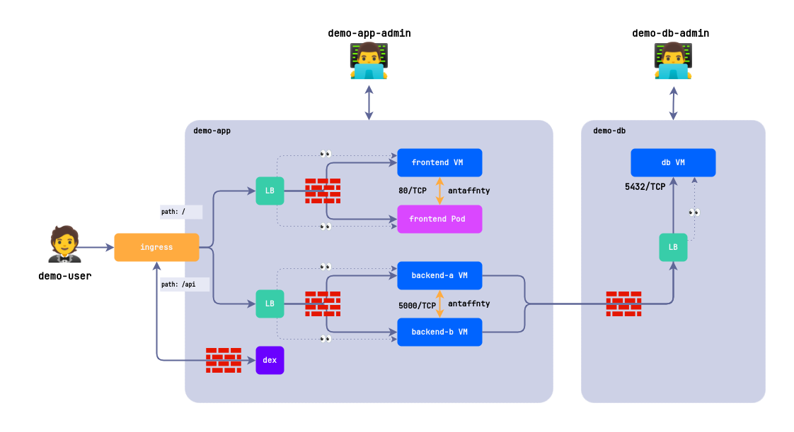

# Three-Tier Application Demo

## Overview

A demo application with a three-tier architecture (**Frontend → Backend → Database**) designed to:

1. Show the capabilities of the cloud platform
2. Demonstrate how Network Policies work
3. Example of integration with Dex authentication system
4. Testing the interaction of components in a virtualized environment



### Application Structure

- **Project: demo-db**
  - **Database**
    - VM: `db` (PostgreSQL)
- **Project: demo-app**
  - **Frontend**
    - VM: `frontend` (Bootstrap app)
    - Pod: `frontend` (Bootstrap app)
  - **Backend**
    - VM: `backend-a` (Flask + Gunicorn)
    - VM: `backend-b` (Flask + Gunicorn)

Component interaction is restricted by network policies. Application access requires authentication via Dex.

## Access System

| User                       | Role                             | Access Rights                            |
| -------------------------- | -------------------------------- | ---------------------------------------- |
| `demo-user@flant.com`      | Application User                 | Access via web interface                 |
| `demo-db-admin@flant.com`  | Project Administrator `demo-db`  | Full VM access with PostgreSQL           |
| `demo-app-admin@flant.com` | Project Administrator `demo-app` | Management of all application components |

Translated with DeepL.com (free version)

## Repository Structure

- `/apps` - Frontend and backend source code
- `/k8s` - Kubernetes deployment manifests

## Requirements

Make sure you install the following packages:

- [task](https://taskfile.dev)
- [yq](https://github.com/mikefarah/yq)

Ensure the following d8 modules are enabled and configured:

- `admission-policy-engine`
- `cni-cilium`
- `console`
- `multitenancy-manager`
- `service-with-healthchecks`
- `user-authn`
- `virtualization`

## Installation

1. Create a `.env` file with infrastructure settings:

```ini
STORAGE_CLASS=linstor-thin-r1
PASSWORD=password
FQDN=demo.example.com
```

2. Genereate ssh key to access VMs via ssh

```bash
task ssh-gen
```

3. Install APP

```bash
task deploy
```

4. Uninstall APP

```bash
task undeploy
```

## How to connect to VM

Via SSH

```bash
d8 v ssh -n demo-app cloud@<vmname> -i ./tmp/demo --local-ssh
```

Via console

```bash
d8 v console -n demo-app <vmname>
```
